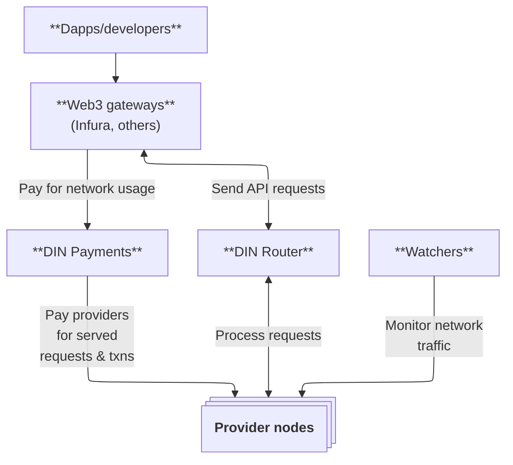

# Architecture

DIN uses a decentralized structure composed of multiple actors:

- [**Node providers**](node-providers/index.md) - Node providers for different networks serve traffic via the DIN Router.
  These providers are compensated for their fulfilled traffic.
- [**Watchers**](watchers/index.md) - Watchers monitor the health of the network traffic.
  The DIN dashboard is the source of truth for the processed requests by node providers.
- [**Web3 gateways**](web3-gateways/index.md) - Web3 gateways connect to DIN nodes and pay for processing traffic from node providers.
  - **Web3 customers** - These individuals or companies interact directly with web3 gateways through their provided identities and processes.
    They receive services and pay for service level agreements covered by the web3 gateways.

## Key components

- **DIN Router** - A service registry that routes traffic between consumers and providers.
- **DIN Payments** - Mechanisms for paying from provider to provider, for successfully processed transactions and APIs.
- **Staking contracts** - Contracts that enforce economic accountability.
- **Performance monitoring systems** - Systems that ensure service level agreement (SLA) compliance.
- **Smart contracts** - Contracts that manage node registration, network mapping, payment, and governance.

## How DIN works

DIN operates through a multi-layered, decentralized infrastructure that ensures robust, scalable, and efficient blockchain API services.
The core layers include:

**1. Request routing layer:**

- [Web3 gateway](web3-gateways/index.md) API requests are routed through the DIN Router,
  which dynamically selects an optimal node provider based on performance,
  load balancing, reputation, and network proximity.
- The DIN Router prioritizes responses from node providers with high uptime and low latency,
  ensuring an efficient service experience.

**2. Infrastructure and validation layer:**

- [Node providers](node-providers/index.md) provide the fundamental infrastructure by running blockchain nodes
  and handling API requests based on the provided technical specifications.
- [Watchers](watchers/index.md) independently listen to open telemetry data from the DIN Router
  and validate responses, checking for correctness, latency, and uptime.
- Performance metrics are continuously recorded and used for staking rewards and penalties managed through the AVS.

**3. Economic security and staking layer (AVS):**

- Staking contracts manage the economic incentives of DIN,
  requiring node providers and watchers to stake assets to participate.
  [DIN as an AVS](avs/index.md) handles the staking rewards and penalties.
- The EigenLayer integration ensures that nodes with poor performance are economically penalized
  via slashing mechanisms, while high-performing nodes receive greater rewards.
- Slashing conditions: If an operator repeatedly fails to meet SLA standards,
  a portion of their staked tokens is slashed.

**4. Governance and automation layer (future state):**

- DIN operates under a Decentralized Autonomous Organization (DAO) model,
  allowing stakeholders to vote on key protocol updates and economic parameters.
- Smart contracts automate governance proposals, ensuring transparency and trustless decision-making.
- Governance controls key aspects, including staking requirements, node licensing, and fee structures.

**5. Payment and settlement layer:**

- DIN uses an onchain payment system,
  enabling transparent, automated transactions between web3 gateways and node providers.
- Subscription and pay-as-you-go models: Web3 gateways use pay-per-request via smart contracts
  to stream data to different node providers.
- Reward distribution follows a performance-based model, ensuring high-quality services.

By structuring its architecture in this modular way,
DIN ensures that blockchain API services remain decentralized, reliable, and economically secure
while supporting seamless scaling across multiple blockchain networks.
