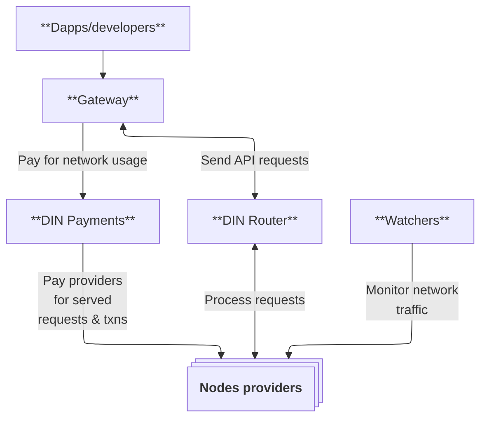

# Gateways

Gateways (for example, Infura) provide API services to Web3 developers. A gateways runs a DIN Router
which routes API requests across qualified provider nodes.
Developers continue to use their gateway-issued API keys and endpoints; DIN operates behind the scenes.

:::info
If you need onboarding support as a Gateway, email the DIN team at [`din@consensys.net`](mailto:din@consensys.net).
:::

### DIN Router

The router is a service registry and traffic manager that discovers eligible providers, evaluates health
and reputation, and forwards requests accordingly.

Capabilities:

- Run your own router with your identity, payment rails, and routing policy.
- Join an existing router operated by another gateway (for example, Infura) with scoped customization.
- Select endpoints dynamically.
- Monitor usage.
- Manage settlements via DIN Payments.

:::info
Email the DIN team at [`din@consensys.net`](mailto:din@consensys.net) for assistance in running and configuring a router.
:::