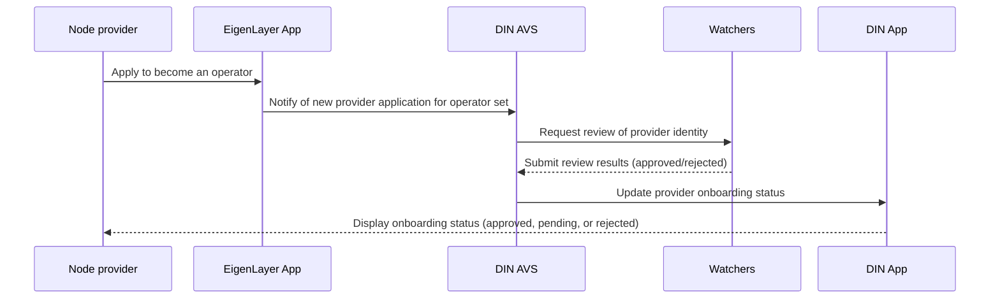
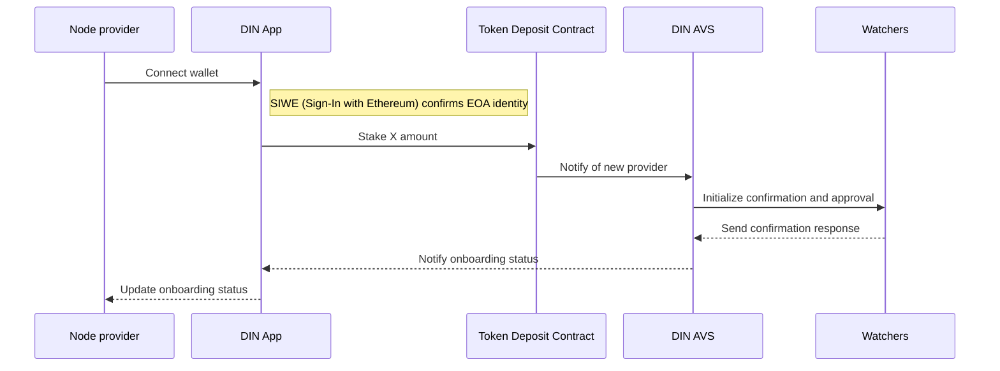
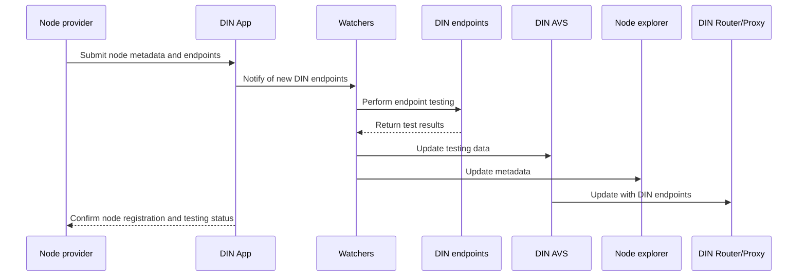

# Onboard as a node provider

Node providers must acquire a license to participate in DIN, which is obtained by joining the DIN AVS through EigenLayer restaking (or staking tokens in the staking contract).
Upon registration, providers declare the blockchain protocols they support, such as Ethereum, Layer 2 networks, or additional Layer 1s, and detail their API capabilities in the Node Registry.
Node providers are then available to service requests from users, governed by SLA requirements and monitored by [watchers](../watchers/index.md).

The identity registration of the infrastructure providers and the nodes for specific blockchain protocol services
are separate.
The completed registration of an infrastructure provider adds its identity for the application and set of tools
via EigenLayer,
while the individual set of nodes fulfilling the blockchain protocol requirements are separately tested
and audited by the watchers.
This allows specific nodes to be removed without necessarily removing the provider entity.
A provider may have an overall reputation that is impacted by their combination of nodes operating across networks.

Get started onboarding via the following forms on the DIN App:

## Provider Onboarding Form (with operator sets)

The DIN App Provider Onboarding Form allows node providers to onboard into the AVS as an operator in the proper operator set.
The steps are as follows:

1. Node provider uses the EigenLayer application to become an operator.
2. DIN AVS is notified of applying node provider to an operator set.
3. Node provider is reviewed by watchers to be added to identity.
4. DIN App is updated with a status for node provider from the DIN AVS process.

## Provider Onboarding Form (with Token Deposit Contract)

The DIN App Provider Onboarding Form allows node providers to onboard via the DIN Token Deposit Contract and AVS.
The steps are as follows:

1. Node provider connects wallet and uses SIWE EOA identity for staking.
2. Interface for staking X amount to DIN Token Deposit.
3. DIN AVS is notified of the new node provider identity to initialize watcher confirmation and approval.
4. DIN App is updated with a status for node provider.

## Provider New Node Form

The DIN App Provider New Node Form allows node providers to register their node metadata and endpoints to initialize testing with watchers.
The steps are as follows:

1. Watchers informed on newly added DIN endpoints.
2. Watchers perform endpoint testing.
3. Watchers update testing data to AVS and node explorer metadata.
4. DIN Router / Proxy updated with DIN endpoints.

