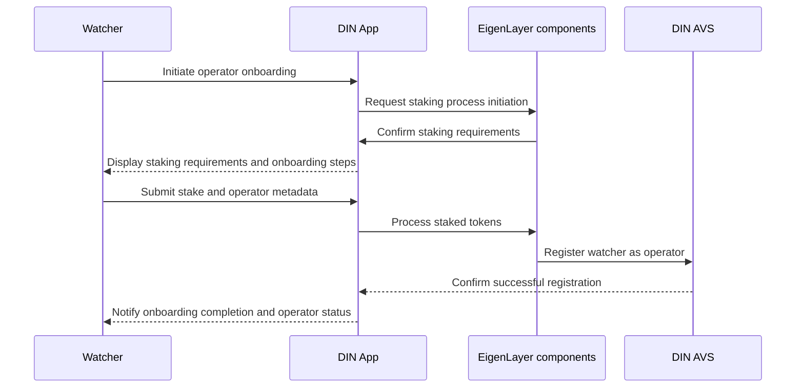

# Onboard as a watcher

Watchers need to join the DIN AVS as an operator.
This requires the deleted staking to run the shared explorer and onboarding functionality.
The process of being added as an operator is handled by the EigenLayer components.

