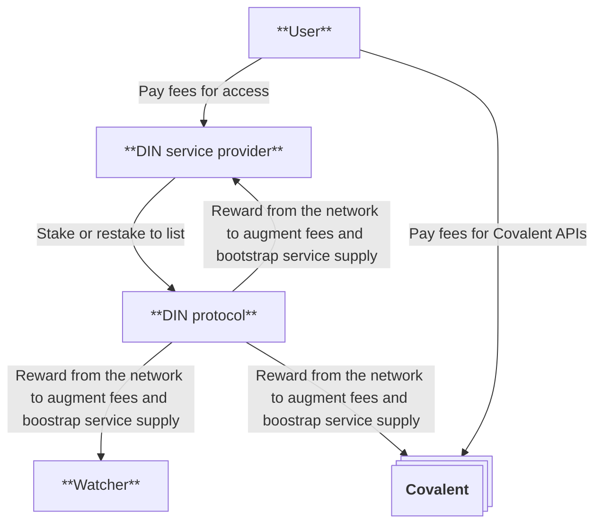

# Manage payments

The Ingress Operators pay DIN Providers via DIN Payments for their processed requests/relays through the DIN Router.
The costs for specific relays are not currently in a granular method-based pricing.
The service level agreements (SLAs) for each network are agreed upon between the DIN Provider and Infura teams.

- Is there a bespoke services contract for each network or across the DIN set of services?

- Are there SLAs for DIN?
  - **Answer:** Yes.
    We will be putting into place the SLA as part of the Watcher protocol going live, which will occur prior to your onboarding.

- Are there SLAs for each of the networks from each of the providers?
  - **Answer:** Yes.
    We will share these for each network.
    These SLAs are enforced by the watcher.

- What available resources are there to help with the onboarding and implementation of access to the set of DIN Services (e.g. RPC for specific networks)?

- How do I pay for these services?
  - What is the DIN Payment module?
  - How can I access it?
  - How can I withdraw funds from this module or network?

- Do these payments get distributed directly to the node providers?

