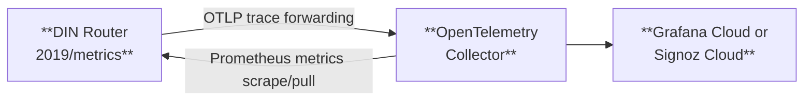

# Monitor usage

The DIN Watcher function consists of a variety of monitoring tools, including an OpenTelemetry Collector that can be used for your own SRE review.
The telemetry collector:

- Listens to the OTLP Trace forwarding component in OTLP format.
- Scrapes Prometheus metric data from DIN Router directly from the router's `/metrics` endpoint.
- Updates our internal Signoz Cloud dashboard for troubleshooting and metrics.

It is up to the Web3 gateway to determine what they want to do with the Open Telemetry Data (e.g. follow our tooling to show into Signoz dashboard).

## FAQs

What dashboards can we expect to see on the performance of DIN Providers or the DIN Router? Completed relays?

DIN Router data is added to the Open Telemetry collector and processed into a Signoz Cloud dashboard.

What is the DIN Observability Dashboard? Can I get access to it?

DIN is in the process of building app.din.build in order to provide a more "SaaS-based" interaction with the DIN Router and other DIN components.

Can you create other dashboards for the desired data?

Since you will be given the API of the collected metrics, you can use that to build other dashboards.
    We will always take suggestions related to the DIN Observability Dashboard, but further customizations are best made by consuming the API and building those view into your own application.

