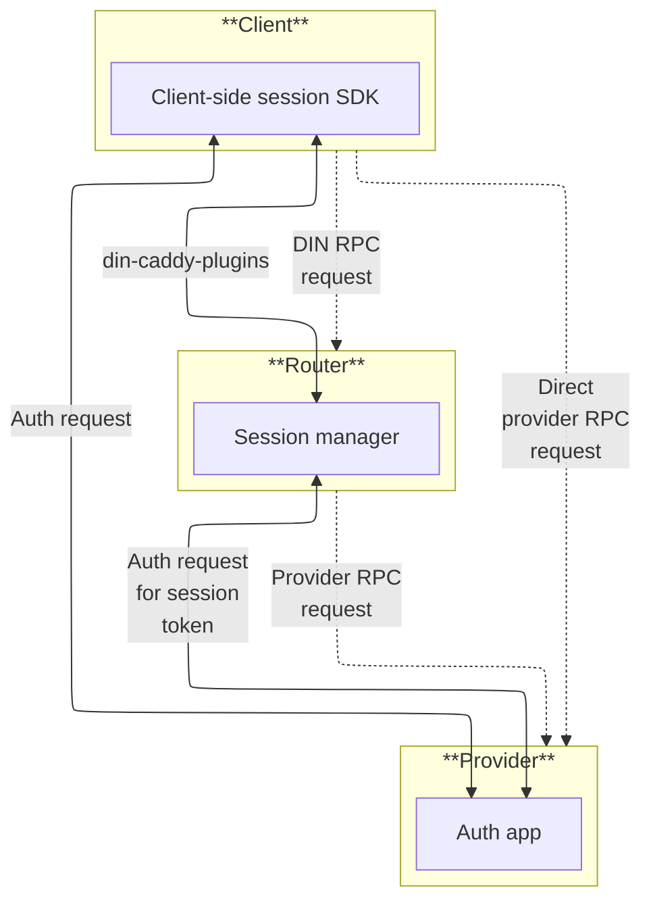
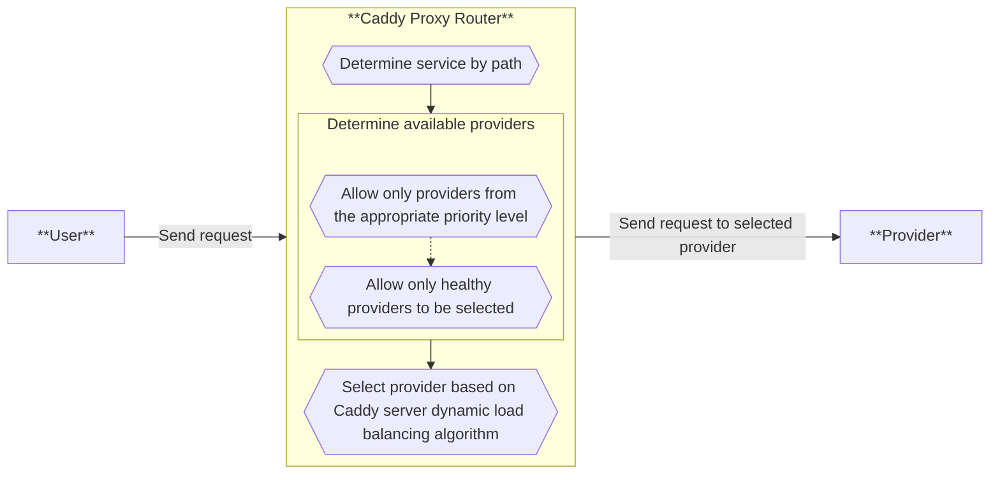

# Onboard as a web3 gateway

TO DO: Clarify what content is needed here.

---

## DIN authentication process

This section describes how a gateway would be added as an Ingress Operator for the router.
We have mainly done this manually (as Infura was our only ingress operator in scope), but we are expanding the authentication protocol to include the additional handshake.
The alpha testing for security purposes will likely remain manual (in collaboration with our dev team).

<p align="center">



</p>

- Is this a registered IP Address or domain that can ping the DIN Router? 
  - **Answer:** Yes, this is a DNS (registered IP address).

- Is there a smart contract allow list or is it a manual handshake process for now? 
  - **Answer:** It would be a manual handshake for now, with the allowlist being stored in a configuration file until the smart contract registry is up and running.

- How does Infura do this? 
  - **Answer:** Currently, Infura does not authenticate to the DIN Router, but we are adding this functionality as we expand the services to more web3 gateways.

### Configuration

In the initial implementation of the authentication protocol, the bare minimum configuration will require:

- **DIN Router**
  - A web3 EOA private key to sign requests
  - The existing configuration mapping services to provider endpoints

- **DIN Provider**
  - A allowlist of web3 addresses to accept requests from
  - A secret key to create signed session tokens (this should be shared across all Caddy instances run by the same provider)
  - A configuration mapping services to backend endpoints (this will allow providers to run one set of DIN Provider Proxies for an arbitrary number of services).

### Protocol

1. For each service / provider pairing, the DIN Router will establish a session.

    1. The DIN Router will send an [EIP-4361](https://eips.ethereum.org/EIPS/eip-4361) authenticated message to the DIN Provider at `https://$PROVIDER_ENDPOINT/auth`.
        The Sign In With Ethereum message will have the form:

        ```text
        Message: $MESSAGE
        $DOMAIN wants you to sign in with your Ethereum account:
        $SIGNER_ADDRESS

        URI: $PROVIDER_URL/auth
        Version: 1
        Chain ID: 1
        Nonce: $NONCE
        Issued At: $ISSUED_AT
        Expiration Time: $EXPIRE_TIME
        ```

        - `$MESSAGE` - At this time, the contents of this field is not important.
          Within the Sign In With Ethereum protocol, this is intended to be shown to the user signing with a wallet.
          As these signatures will be automated, this field can be ignored, but will be included by Sign In With Ethereum libraries.
        - `$DOMAIN` - Domain should reflect the address of the router.
        - `$SIGNER_ADDRESS` - Should match the address used to sign this message.
        - `$PROVIDER_URL` - should match the public address of the provider verifying this message.
        - `$NONCE` - This is a random value specified by the signer to distinguish this request from others. 
        - `$ISSUED_AT` - An ISO-8601 Timestamp of when this message was created
        - `$EXPIRE_TIME` - An ISO-8601 Timestamp of when this message should no longer be accepted.
          Note that this is not the expiration of the token being requested, just for this request.
          It should generally be within a few minutes.

        This message should be included in a JSON payload of the form:

        ```text
        {"msg": "Message: ... Expiration Time...", "sig": "0x12234...0abcd"}
        ```

        Where `sig` should be the signature produced by signing the message with the private key associated with `$SIGNER_ADDRESS`.

    2. The DIN Provider will verify the message, and confirm that the signer appears in its allowlist.
        If the message does not verify or the signer is not in the allowlist, the DIN provider should respond with a 401 status code.

    3. The DIN Provider will respond with:

        ```text
        {
          "headers": {"x-api-key": "$API_KEY"},
          "exp": $EXPIRATION_TIME,
          "uses": $USES_LIMIT,
          "error": $ERROR_MESSAGE
        }
        ```

        - `$API_KEY` - The API key generated by the provider.
          The provided DIN caddy plugins will have a JWT token here, but from a protocol perspective it should be treated as an opaque key.
        - `$EXPIRATION_TIME` - A unix timestamp after which this key will no longer be accepted.
          Either this or `uses` should be specified, not both.
        - `$USES_LIMIT` - The number of times this key may be used.
          Either this or `exp` should be specified, not both.
        - `$ERROR_MESSAGE` - A message indicating why the other fields could not be provided.

2. For each request to the DIN Router:

    1. The DIN Router will select a provider that offers the service capable of handling the incoming request.

    2. If there is a current API Key available for that service / provider pairing, the router will forward the RPC request to that provider including the API Key associated with the session in the `x-api-key` header.

        1. If there is not a current API key for that service / provider pairing, the DIN Router should establish a session as defined above.

    3. The DIN Provider will verify the API key in the `x-api-key` header, and ensure that it is associated with the appropriate service.

        1. If the API key is not present, the provider should respond with a 401 status code.

        2. If the API key is present, but is expired or does not authorize access to the request service, the provider should respond with a 403 status code.

        3. If the API key verifies successfully, the provider should proxy the request to the backend service and return the response.

## DIN Router initial registration

This section answers questions on how we manually add the Web3 Gateway / Ingress Operator with your appropriate permissions. A Caddy Proxy router set of configurations is used to make the connection between the user and the provider.

<p align="center">



</p>

- What are the security requirements for this?
  - **Answer:** Currently, the registration would be done via Sign In with Ethereum, and the DIN team would allowlist the Ethereum address that the new gateway is using to access the DIN Router.

- Is there an example handshake and what is registered (for example, IP addresses vs domains)?
  - **Answer:** Example code is available that can be shared.
    An Ethereum address is required in order to authenticate.

- What rate limiting protection is created here?
  All rate limiting is enforced on the Gateway side, and therefore Gateway providers must be able to pay for the requests that they use.
  - **Answer:** The DIN Router will enforce some blocking of certain methods, but the assumption is that any requests that are sent to the DIN Router by a gateway are expected to be returned.
    Therefore, there will be a list of methods that we will suggest do not make sense to forward to the DIN Router for certain networks.

## DIN Router network configuration

An Ingress Operator will choose between different registered networks/chains and their set technical requirements (for example, methods, RPS, volume, advanced methods).
The full list of these available networks and requirements has not been rendered into a web application, but we can use the Infura documentation as a starting point for which networks and methods are supported. 

- How do I select which available networks (mainnet and testnet) where I can be added to requests?

  - Is this the caddy file?
    - **Answer:** The DIN team is able to provide a list of available networks where requests can be sent.
      This list will typically only include networks that are "production-ready" - they can receive requests at an RPS in the thousands.
      Sometimes, we will make available networks that are in pre-production, largely for integration purposes and for some testing.

  - Is there a list of these chains?
    - **Answer:** The DIN team keeps a list of supported chains that are available for your consumption.

  - Do I use a fixed reference on my side? The router side?
    - **Answer:** You will use a fixed reference to the relevant DIN Router endpoint for each network you are consuming within your routing logic.

  - How can I change this?
    - **Answer:** You will likely not need to change the DIN endpoints, but in the event you do, you will be responsible for changing to any new DIN endpoints that are provided to you.

- What are the expected methods available for each of the DIN Provider networks?
  - **Answer:** The DIN team will provide a list of methods for each supported chain.

- Can I set any routing preferences for this particular chain?
  - **Answer:** Potentially, if you have specific routing preferences you will work with the DIN team to see if these preferences can be implemented.
